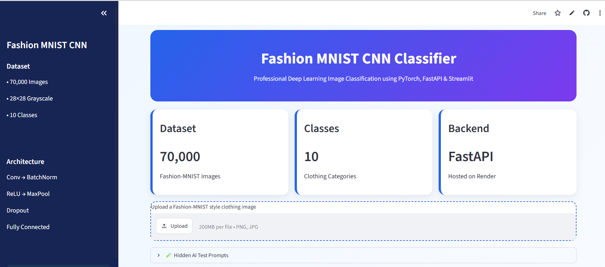

# 👕 Fashion MNIST CNN Classifier

A production-ready Deep Learning image classification project built with **PyTorch**, **FastAPI**, **Streamlit**, and deployed on **Render** and **Streamlit Community Cloud**.

## 🌐 Live Demo

- **Streamlit App:** https://deeplearningprojects-robel.streamlit.app/
- **FastAPI API:** https://fashion-mnist-cnn-api.onrender.com/
- **Swagger Docs:** https://fashion-mnist-cnn-api.onrender.com/docs

---

## 📸 Screenshots

### 1. Home Page



### 2. Image Upload


### 3. Prediction Result


### 4. FastAPI Swagger API


---

## 📖 Project Overview

This project classifies grayscale clothing images into **10 Fashion-MNIST categories** using a Convolutional Neural Network (CNN). It demonstrates the complete deep learning workflow from model training to cloud deployment.

### Features

- PyTorch CNN model
- Batch Normalization
- Dropout Regularization
- Early Stopping
- FastAPI REST API
- Streamlit Web Application
- Render Cloud Deployment
- Top-3 Prediction Probabilities

---

## 🧠 Dataset

**Fashion-MNIST**

- 70,000 grayscale images
- 28 × 28 image size
- 10 clothing categories

| Label | Class       |
| ----- | ----------- |
| 0     | T-shirt/Top |
| 1     | Trouser     |
| 2     | Pullover    |
| 3     | Dress       |
| 4     | Coat        |
| 5     | Sandal      |
| 6     | Shirt       |
| 7     | Sneaker     |
| 8     | Bag         |
| 9     | Ankle Boot  |

---

## 🏗 CNN Architecture

```text
Input (1×28×28)
      │
Conv2D (1→16)
      │
BatchNorm
      │
ReLU
      │
MaxPool
      │
Conv2D (16→32)
      │
BatchNorm
      │
ReLU
      │
MaxPool
      │
Flatten
      │
Linear (1568→128)
      │
ReLU
      │
Dropout
      │
Linear (128→10)
      │
Prediction
```

---

## 📁 Project Structure

```text
Fashion_MNIST_CNN_Classifier/
│
├── assets/
├── app/
├── api/
├── src/
├── models/
├── notebooks/
├── requirements.txt
├── .gitignore
└── README.md
```

---

## ⚙️ Technologies

- Python
- PyTorch
- Torchvision
- FastAPI
- Streamlit
- Pillow
- Requests
- Uvicorn

---

## 🚀 Run Locally

### Install dependencies

```bash
pip install -r requirements.txt
```

### Start FastAPI

```bash
uvicorn api.main:app --reload
```

### Start Streamlit

```bash
streamlit run app/streamlit_app.py
```

---

## 👨‍💻 Author

**Robel Gebregziabher**

Information Technology Student • AI & Deep Learning Enthusiast

GitHub: **robelgher16-ai**
